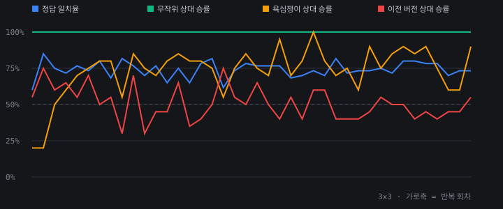
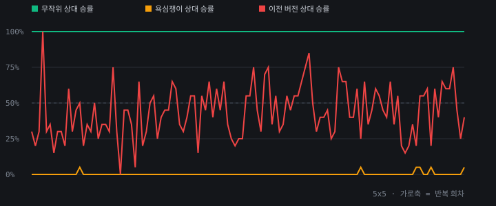

# 학습 성적표

## 3x3

- 반복 40회차까지 진행
- 정답 일치율: **73%** (탐색) / 70% (신경망 직감)
- 무작위 상대 승률: **100%**
- 욕심쟁이 상대 승률: **90%**
- 마지막 손실: 정책 2.048 / 가치 0.097
- 신경망이 교체된 횟수: 17회

회차별 기록

| 회차 | 정답일치 | 무작위 | 욕심쟁이 | 이전판대비 | 교체 | 정책손실 | 가치손실 | 초 |
|---|---|---|---|---|---|---|---|---|
| 1 | 60% | 100% | 20% | 55% | O | 2.2578 | 0.0407 | 24.6 |
| 2 | 85% | 100% | 20% | 75% | O | 2.1848 | 0.0511 | 21.7 |
| 3 | 75% | 100% | 50% | 60% | O | 2.1388 | 0.0505 | 21.5 |
| 4 | 72% | 100% | 60% | 65% | O | 2.108 | 0.051 | 21.5 |
| 5 | 77% | 100% | 70% | 55% | O | 2.0848 | 0.0536 | 21.0 |
| 6 | 73% | 100% | 75% | 70% | O | 2.066 | 0.0472 | 21.2 |
| 7 | 80% | 100% | 80% | 50% |  | 2.0628 | 0.0485 | 21.1 |
| 8 | 68% | 100% | 80% | 55% | O | 2.0659 | 0.066 | 21.3 |
| 9 | 82% | 100% | 55% | 30% |  | 2.0592 | 0.0662 | 21.3 |
| 10 | 77% | 100% | 85% | 70% | O | 2.0647 | 0.0813 | 21.5 |
| 11 | 70% | 100% | 75% | 30% |  | 2.0566 | 0.0602 | 21.1 |
| 12 | 77% | 100% | 70% | 45% |  | 2.0475 | 0.0728 | 21.3 |
| 13 | 65% | 100% | 80% | 45% |  | 2.0498 | 0.0869 | 21.2 |
| 14 | 75% | 100% | 85% | 65% | O | 2.0519 | 0.0911 | 21.1 |
| 15 | 65% | 100% | 80% | 35% |  | 2.0439 | 0.0781 | 21.3 |
| 16 | 78% | 100% | 80% | 40% |  | 2.0595 | 0.086 | 21.3 |
| 17 | 82% | 100% | 75% | 50% |  | 2.0546 | 0.0931 | 21.3 |
| 18 | 62% | 100% | 55% | 75% | O | 2.0551 | 0.1014 | 21.2 |
| 19 | 73% | 100% | 75% | 55% | O | 2.0524 | 0.0894 | 21.2 |
| 20 | 78% | 100% | 85% | 50% |  | 2.0445 | 0.0753 | 21.1 |
| 21 | 77% | 100% | 75% | 65% | O | 2.0496 | 0.081 | 21.2 |
| 22 | 77% | 100% | 70% | 50% |  | 2.04 | 0.0737 | 21.1 |
| 23 | 77% | 100% | 95% | 40% |  | 2.0519 | 0.081 | 21.1 |
| 24 | 68% | 100% | 70% | 55% | O | 2.0372 | 0.0837 | 21.2 |
| 25 | 70% | 100% | 80% | 40% |  | 2.0385 | 0.076 | 21.2 |
| 26 | 73% | 100% | 100% | 60% | O | 2.0434 | 0.0795 | 21.3 |
| 27 | 70% | 100% | 80% | 60% | O | 2.0427 | 0.075 | 21.4 |
| 28 | 82% | 100% | 70% | 40% |  | 2.0385 | 0.0727 | 21.2 |
| 29 | 72% | 100% | 75% | 40% |  | 2.0356 | 0.0745 | 21.3 |
| 30 | 73% | 100% | 60% | 40% |  | 2.0421 | 0.0788 | 21.1 |
| 31 | 73% | 100% | 90% | 45% |  | 2.0423 | 0.0829 | 21.1 |
| 32 | 75% | 100% | 75% | 55% | O | 2.0423 | 0.0864 | 21.3 |
| 33 | 72% | 100% | 85% | 50% |  | 2.0449 | 0.0827 | 21.1 |
| 34 | 80% | 100% | 90% | 50% |  | 2.0405 | 0.085 | 21.2 |
| 35 | 80% | 100% | 85% | 40% |  | 2.0398 | 0.0875 | 21.4 |
| 36 | 78% | 100% | 90% | 45% |  | 2.0443 | 0.0909 | 21.3 |
| 37 | 78% | 100% | 75% | 40% |  | 2.0363 | 0.0932 | 21.1 |
| 38 | 70% | 100% | 60% | 45% |  | 2.0468 | 0.0971 | 21.1 |
| 39 | 73% | 100% | 60% | 45% |  | 2.0486 | 0.0977 | 21.1 |
| 40 | 73% | 100% | 90% | 55% | O | 2.048 | 0.097 | 21.1 |

## 5x5

- 반복 118회차까지 진행
- 정답 일치율: **-** (탐색) / - (신경망 직감)
- 무작위 상대 승률: **100%**
- 욕심쟁이 상대 승률: **5%**
- 마지막 손실: 정책 3.1076 / 가치 0.1354
- 신경망이 교체된 횟수: 42회

회차별 기록

| 회차 | 정답일치 | 무작위 | 욕심쟁이 | 이전판대비 | 교체 | 정책손실 | 가치손실 | 초 |
|---|---|---|---|---|---|---|---|---|
| 79 | - | 100% | 0% | 40% |  | 3.1216 | 0.1531 | 154.9 |
| 80 | - | 100% | 0% | 40% |  | 3.1201 | 0.1519 | 154.4 |
| 81 | - | 100% | 0% | 45% |  | 3.1198 | 0.1529 | 154.5 |
| 82 | - | 100% | 0% | 25% |  | 3.1214 | 0.1524 | 155.2 |
| 83 | - | 100% | 0% | 30% |  | 3.115 | 0.1516 | 154.2 |
| 84 | - | 100% | 0% | 75% | O | 3.1175 | 0.1514 | 154.6 |
| 85 | - | 100% | 0% | 65% | O | 3.1245 | 0.1511 | 154.4 |
| 86 | - | 100% | 0% | 65% | O | 3.1208 | 0.1508 | 152.5 |
| 87 | - | 100% | 0% | 40% |  | 3.1214 | 0.1486 | 154.6 |
| 88 | - | 100% | 0% | 40% |  | 3.1198 | 0.1466 | 154.1 |
| 89 | - | 100% | 0% | 60% | O | 3.1172 | 0.145 | 154.1 |
| 90 | - | 100% | 5% | 25% |  | 3.1214 | 0.1441 | 155.9 |
| 91 | - | 100% | 0% | 65% | O | 3.1197 | 0.1428 | 154.4 |
| 92 | - | 100% | 0% | 35% |  | 3.1202 | 0.1412 | 154.6 |
| 93 | - | 100% | 0% | 45% |  | 3.1173 | 0.1414 | 154.9 |
| 94 | - | 100% | 0% | 60% | O | 3.116 | 0.14 | 153.9 |
| 95 | - | 100% | 0% | 55% | O | 3.1188 | 0.1394 | 153.8 |
| 96 | - | 100% | 0% | 45% |  | 3.1132 | 0.1386 | 152.2 |
| 97 | - | 100% | 0% | 40% |  | 3.1152 | 0.1393 | 152.4 |
| 98 | - | 100% | 0% | 65% | O | 3.1158 | 0.1391 | 152.3 |
| 99 | - | 100% | 0% | 35% |  | 3.1134 | 0.1385 | 154.2 |
| 100 | - | 100% | 0% | 55% | O | 3.1124 | 0.138 | 153.6 |
| 101 | - | 100% | 0% | 20% |  | 3.1172 | 0.1383 | 154.7 |
| 102 | - | 100% | 0% | 15% |  | 3.1164 | 0.137 | 155.5 |
| 103 | - | 100% | 0% | 20% |  | 3.1164 | 0.1375 | 156.1 |
| 104 | - | 100% | 0% | 35% |  | 3.1157 | 0.1378 | 154.5 |
| 105 | - | 100% | 5% | 20% |  | 3.1175 | 0.1366 | 156.1 |
| 106 | - | 100% | 5% | 55% | O | 3.1145 | 0.1356 | 155.5 |
| 107 | - | 100% | 0% | 55% | O | 3.1096 | 0.1349 | 154.1 |
| 108 | - | 100% | 0% | 60% | O | 3.1127 | 0.1355 | 152.8 |
| 109 | - | 100% | 5% | 20% |  | 3.1131 | 0.1357 | 154.9 |
| 110 | - | 100% | 0% | 60% | O | 3.1169 | 0.1365 | 154.4 |
| 111 | - | 100% | 0% | 40% |  | 3.112 | 0.134 | 152.5 |
| 112 | - | 100% | 0% | 65% | O | 3.107 | 0.1333 | 153.2 |
| 113 | - | 100% | 0% | 60% | O | 3.1095 | 0.1344 | 153.9 |
| 114 | - | 100% | 0% | 60% | O | 3.1103 | 0.1336 | 152.4 |
| 115 | - | 100% | 0% | 75% | O | 3.1112 | 0.1354 | 150.3 |
| 116 | - | 100% | 0% | 45% |  | 3.1041 | 0.1349 | 153.7 |
| 117 | - | 100% | 0% | 25% |  | 3.1059 | 0.1349 | 153.4 |
| 118 | - | 100% | 5% | 40% |  | 3.1076 | 0.1354 | 153.1 |

---

**보는 법**

- 정답 일치율: 완전 탐색으로 구한 '진짜 정답'과 얼마나 맞는지. 작은 판에서만 잴 수 있음. 이게 오르면 제대로 배우는 중.
- 무작위 상대 승률: 금방 100%가 됨. 여기서 안 오르면 학습이 아예 안 도는 것.
- 욕심쟁이 상대 승률: 칸을 딸 수 있으면 무조건 따는 단순한 상대. 이걸 넘기려면 '일부러 내주고 나중에 크게 먹기'를 배워야 함.
- 이전 버전 상대 승률: 55%를 넘으면 새 신경망으로 교체됨. 계속 50% 근처면 더 이상 늘지 않는 중.